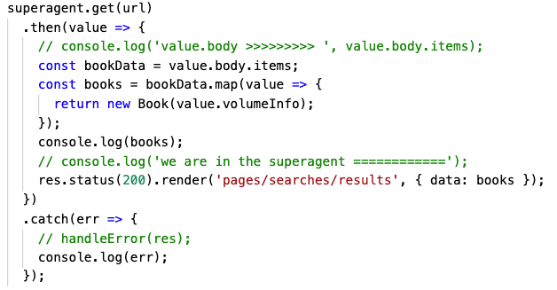
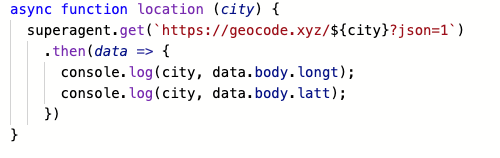

**Describe what Array.map() does**

.map() is a Javascript array method that iterates over the array that it is chained onto (ie someArray.map()), and performs a callback function on each element in that array. This callback function is written by the developer and once that callback has run on each index position of the array, returns a NEW array with the results of the callback function.  

**Describe what Array.reduce() does**

.reduce() is a Javascript array method that is used to change the shape of your data.  For example, if you have an array of numbers, you would use array.reduce() to return the sum of all of the numbers in the array.  The callback function takes two parameters: accumulator (which is the end result) and value (which is the value of the array at an index position).  The third element of this method is the starting point of the accumulator.  This be a number, an empty array, or an empty object.  This is included after the callback function but before the closing parentheses. 

**Provide code snippets showing how to use superagent() to fetch data from a URL and log the result**
    - With a normal Promise .then() syntax

**With async / await syntax**

**Explain promises to a new 301 student**
Hey 301 student! As you can tell your learning has been continuously building on previous information.  Promises are like, the next level of functions.  Likely your concept of functions is that they are declared, the are invoked, and assuming you don't have any syntax error will run.  Promises are used when you are requesting information from an API and information from the request is used in subsequent code.  Assuming the request is successful, THEN the function runs more code which is dependent upon the information that was sent in response.  If the request was not successful, a creating a promise allows you to generate and log where the error happened.

**Are all callback functions considered to be asynchronous? Why or why not**

Not necessarily. An asynchronous function means that one function's actions do not need to be completed for the next function to run.  While you can structure a callback in this way, it is also possible to have callback functions that run that are dependent on the result of a previous function. 